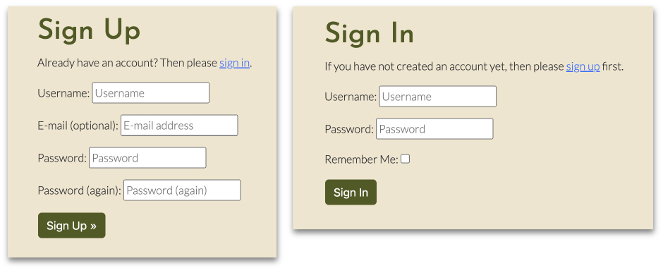
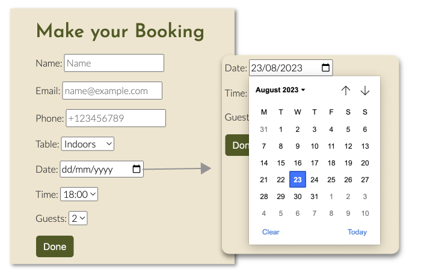

Full-Stack Project – HTML5 | CSS3 | Bootstrap 5 | Django | Python | PostgreSQL | Cloudinary.

<!-- TOC --><a name="the-fourth-fork"></a>
# The Fourth Fork


This web application, named "The Fourth Fork," is the fourth Portfolio Project for the Diploma in Full Stack Software Development with eCommerce at Code Institute. The name is derived from its significance as the fourth project and the dual meaning of "Fork," which relates to both web development and cutlery.

The project aims to allow users to create an account, log in, book a table, view, edit and delete existing bookings.

Check the live web site [here](https://pp04.herokuapp.com/)  

Repository available on [GitHub.](https://github.com/zemaciel/pp4/)

<!-- TOC start  -->

#Table of Content

- [User Experience](#user-experience)
  * [Planning](#planning)
  * [Design](#design)
    + [Mockup](#mockup)
    + [Colours](#colours)
    + [Typography](#typography)
    + [Logo and Favicon](#logo-and-favicon)
- [Database Schema](#database-schema)
  * [Tables Details](#tables-details)
- [Features](#features)
  * [Frontend](#frontend)
    + [Navigation Bar](#navigation-bar)
    + [Hero Image](#hero-image)
    + [Restaurant Menu](#restaurant-menu)
    + [Call-to-action](#call-to-action)
    + [Footer](#footer)
    + [User Registration and User Login](#user-registration-and-user-login)
    + [Add booking](#add-booking)
    + [Manage bookings](#manage-bookings)
  * [Backend](#backend)
  * [Future Features](#future-features)
- [Testing](#testing)
  * [Manual Testing](#manual-testing)
  * [Validator Testing](#validator-testing)
    + [w3 HTML Validator](#w3-html-validator)
    + [CSS Validation](#css-validation)
    + [Python Validation (PEP8)](#python-validation-pep8)
  * [Lighthouse](#lighthouse)
  * [Error and Bugs](#error-and-bugs)
- [Deployment](#deployment)
  * [Setting Up](#setting-up)
    + [Set up Details](#set-up-details)
  * [Heroku Deployment](#heroku-deployment)
  * [Forking on GitHub:](#forking-on-github)
- [Technologies](#technologies)
- [Credits](#credits)
  * [Code](#code)
  * [Media and design references](#media-and-design-references)
- [Acknowledgements](#acknowledgements)

<!-- TOC end -->

<!-- TOC --><a name="user-experience"></a>
# User Experience

<!-- TOC --><a name="planning"></a>
## Planning

The planning and development of this project adopt principles of Design Thinking and Agile. Cards containing user stories, a short description of a feature that would address a user's need, were placed on a board.

Using MoSCoW prioritisation, the stories were categorised as Must Have (critical requirements), Should Have (important but not essential), Could Have (desirable, but they are not required at this stage), and Won't Have (nice-to-have features, but they are put aside in favour of more urgent needs).

User Stories categorised as Won't Have remained in the backlog column for the next interaction.

I've used GitHub for this process. The board is available at this [link https://github.com/users/zemaciel/projects/2/views/1](https://github.com/users/zemaciel/projects/2/views/1) 

The Issues can be seen here [https://github.com/zemaciel/pp4/issues](https://github.com/zemaciel/pp4/issues)

<!-- TOC --><a name="design"></a>
## Design

<!-- TOC --><a name="mockup"></a>
### Mockup

In the process of designing this project, I began by creating a mockup. This allowed me to make design decisions such as selecting colours, fonts, and determining the placement of each element with ease. Along the way, some adjustments were made. 


<!-- TOC --><a name="colours"></a>
### Colours

For the website, I choose a colour scheme to represent the restaurant's laid-back, cosy and welcoming atmosphere. A palette of rustic earth tones, such as terracotta, olive green, moss and sand, to evoke a sense of warmth and comfort.


<!-- TOC --><a name="typography"></a>
### Typography

The font families chosen for this project are Josefin Sans and Lato, both imported from Google Fonts.


<!-- TOC --><a name="logo-and-favicon"></a>
### Logo and Favicon

I created a straightforward logo for both the navigation bar and the favicon. The design showcases a fork symbol positioned inside the letter "o" in the same colour scheme as the site.


<!-- TOC --><a name="database-schema"></a>
# Database Schema

The database schema is displayed below. The relationship between customers and their bookings is established through the "user_id" columns, which link the two tables. This schema allows the system to store and manage customer information, as well as track their bookings and associated details.


<!-- TOC --><a name="tables-details"></a>
## Tables Details


<details>
<summary>User Table:</summary>

- **user**: This column represents a unique identifier for each customer in the table. It is likely used as the primary key, ensuring each customer has a distinct ID.
- **name**: This column stores the user's first name.
- **last_name**: This column stores the user's last name.
- email: This column stores the user's email address of the customer, useful for communication and identification purposes.
- **username**: This column stores the username chosen by the user for login.
</details>

<details>
<summary>
Booking Table:</summary>

- **id**: This column is the primary key for the "Booking" table. Each booking entry has a unique identifier.
- **user**: This column represents a foreign key that links each booking to a specific customer in the "User" table. It establishes a relationship between bookings and customers, indicating which customer made the booking.
- **create_at**: This column stores the date and time when the booking entry was created.
- **booking_date**: This column stores the date of the booking, indicating when the customer plans to visit.
- **booking_time**: This column stores the time of the booking.
- **guests**: This column stores the number of people in the customer's party or group for the booking.
- **table**: This column stores information about the preferred or assigned table area for the booking, indoors or outdoors.
</details>

<!-- TOC --><a name="features"></a>
# Features

<!-- TOC --><a name="frontend"></a>
## **Frontend**

Main features on the pages that website visitors see and interact with.


<!-- TOC --><a name="navigation-bar"></a>
### ****Navigation Bar****

A responsive Bootstrap navigation bar is located at the top of every page, providing easy access to various sections of the website. The navigation bar includes the restaurant's logo, which acts as a link to the home page, and a menu with different options based on the user's login status.

**When the user is not logged in, the navigation bar options are:**

- Home
- Menu
- Register
- Login

**If the user is logged in, the navigation bar options are:**

- Home
- Menu
- Logout
- My Bookings
- Book a Table

The restaurant menu is on the home page, and the navigation bar link to the Menu points to an anchor tag for that section.

<!-- TOC --><a name="hero-image"></a>
### Hero Image

A professional photograph showing some of the restaurant dishes makes the website more attractive and reflects the restaurant's quality.

<!-- TOC --><a name="restaurant-menu"></a>
### Restaurant Menu

During my research for this project, I came across the website of Savor restaurant and was impressed by their use of tabs in presenting their menu. This approach is both visually appealing and efficient in terms of space utilisation, making it an ideal concept for showcasing the menu on the homepage.

<!-- TOC --><a name="call-to-action"></a>
### Call-to-action

The home page includes an engaging call to action section that encourages users to sign up for the site and book a table. Just like the navigation bar, the call-to-action buttons also adapt based on the user's login status.

**If the user is logged in, there is one prominent option:**

- Book a Table

**Otherwise, there are two buttons urging the user to:**

- Register
- Login

<!-- TOC --><a name="footer"></a>
### Footer

The footer section provides essential contact details, including the restaurant's location and contact information. Additionally, the footer incorporates social media icons that directly link to the restaurant's social media pages,

<!-- TOC --><a name="user-registration-and-user-login"></a>
### User Registration and User Login



A user registration form is presented at the “Sign Up” page, which a user can create their account on the website. 

Registered users can youse the user login form, on the sign ip page, to log onto their account.

<!-- TOC --><a name="add-booking"></a>
### Add booking

After logging in, the users can create a booking via a form that will their reservation to the database at the “Make your Booking” page (booking.html). 

The details they will have to input at this stage are:

- Name
- email
- Phone
- Table - where they select if they want an indoor or outdoor table.
- Date - where they select the date from a calendar
- Time of the booking - they will select from a list of options
- Number o guests - choose from 1 up to 8 guests.



<!-- TOC --><a name="manage-bookings"></a>
### Manage bookings

All books are displayed on mybookings.html in the format of cards, with the main details of the booking. Each card presents two buttons with the option of change the booking or deleting it. 

If the option change is selected, the user is directed to the changebooking.html page, where the same form from Make Your Booking is presented, but this time, pre-field with the information inserted by the user.  

If there are no existing booking presented, then the page informs the user and presents the link to create a booking. 


<!-- TOC --><a name="backend"></a>
## Backend

This project includes an administration area used by website administrators, owners, or maybe, in this case, restaurant staff to manage the bookings, and in the future, can be used to mange the website's content and other functionalities.

In this area, the administrator can see all the existing bookings in a table that show:

- Name used for the booking
- Date of the booking
- Time of the booking
- Date and time when the booking was created

The administrator also has a way to filter the bookings by the date of creation.  


When clicking over the booking, the administrator have access to more details, related to the user and the booking. 


<!-- TOC --><a name="future-features"></a>
## Future Features

There is a lot of room for improvement on this project, and here are a few ideas that could be implemented in the future: 

**Social Media Account Registration:** Allow users to register and log in using their social media accounts (e.g., Facebook, Google, Twitter). This feature will streamline the registration process and attract users who prefer a quick and convenient sign-up method.

**Guest Table Booking:** Provide an option for guests to book a table without requiring them to register. This approach will cater to users who prefer a hassle-free booking experience without creating an account.

**Booking Confirmations via SMS and/or Email:** Enhance customer satisfaction and engagement by implementing a system that sends booking confirmations via SMS and/or email. This proactive communication will give users instant updates and reminders about their reservations.

**Administrator Account for Staff Members:** Introduce an administrator account that allows staff members to manage and update critical information, such as the menu and opening hours.

**Password Reset Functionality:** Implement a feature that allows users to reset their password if they forget it.

**Enhanced Booking System with Seat Allocation:** Optimise the booking system by creating a new database table that tracks the number of available tables/seats. Automatically allocate a specific table/seat for each booking to prevent overbooking and ensure a smooth dining experience for customers.

**Feedback Messages:** The error messages could be more specific to let the user know exactly what went wrong. 

<!-- TOC --><a name="testing"></a>
# Testing

<!-- TOC --><a name="manual-testing"></a>
## Manual Testing
<details>
<summary>
Manual Testing of Main Functionalities for the User:</summary>

- **Authentication**
    - Verify that a user can register on the website. - Pass
    - Verify that a user can log in once registered. - Pass
    - Verify that a user can sign out successfully. - Pass
    - Verify that a user cannot view or manage bookings after signing out. - Pass
- **Booking Forms**
    - Verify that a new booking can be created. - Pass
    - Verify that a booking can be edited. - Pass
    - Ensure a customer cannot book a date in the past. - Pass
    - Verify that a user can successfully delete a booking. - Pass
    - Ensure forms cannot be submitted when required fields are empty. - Pass
- **Navigation Links**
    
    Testing was conducted on both mobile and desktop devices to ensure that all navigation links on the respective pages correctly navigated to the designated pages, following the design. This was accomplished by clicking on the navigation links on each page from various devices.
    
    **Results:** Pass
    </details></br>

Please note that all main functionalities for user authentication, forms, and navigation links were tested manually on both mobile and desktop devices. The outcomes confirmed that they are working as expected and that the site is responsive across different screen sizes.

<!-- TOC --><a name="validator-testing"></a>
## Validator Testing

<details>
<summary>
Checking the code with Validators</summary>
<br>

<!-- TOC --><a name="w3-html-validator"></a>
### **w3 HTML Validator**

All pages were tested using the [w3 HTML Validator](https://validator.w3.org/). Initially, a few minor errors were detected, but they were promptly addressed and corrected, resulting in all pages passing the validation successfully.
Due to the Django templating language, direct input of the HTML code into the validator was unbelievable. Instead, URLs referencing the pages were used for testing and validation purposes.

<!-- TOC --><a name="css-validation"></a>
### **CSS Validation**

The website CSS style has successfully passed the [W3C Jigsaw CSS Validation Service](https://jigsaw.w3.org/css-validator/).

<!-- TOC --><a name="python-validation-pep8"></a>
### Python Validation (PEP8)

I have thoroughly validated all the Python code in our project using the [CI Python Linter](https://pep8ci.herokuapp.com/). The majority of errors were fixed. However, please note that there are still some instances of the "E501 line too long" error in the settings.py file.

As much as I was trying to adhere to the PEP8 guidelines, I preferred to prioritise the readability in those few occurrences of the length line issues.

<!-- TOC --><a name="lighthouse"></a>
## Lighthouse

Based on the Lighthouse test, the performance stands at 83%, which is decent but has room for improvement. However, all other assessed criteria scored above 90%.


</details>
<br>

<!-- TOC --><a name="error-and-bugs"></a>
## Error and Bugs

During the development of the project, a few errors were encountered and addressed. In one of the initial deployments to Heroku, the booking functionality was not functioning correctly. After reviewing settings.py, it was discovered that there was a mistake in the URL of the database input in Heroku. This issue was rectified, and the subsequent deployment occurred without errors.

Manual testing revealed that it was possible to book a table for a date in the past. Thanks to StackOverflow, this problem was also solved.

Initially, the logo in the navbar was an SVG file. When testing in different devices, I noticed it was not rendering correctly. Although I had found on StackOverflow a solution that could fix the problem, due to the short time to test it all again, I preferred to fix the problem using a PNG file instead of an SVG. 

Two issues persisted despite these fixes:

1. In setting.py there are a few lines that exceeded the recommended length.
2. The CSS was not loading through the GitHub repository, necessitating the upload of the static file to Cloudinary. However, a copy of the CSS remains in the repository at static/css.

<!-- TOC --><a name="deployment"></a>
# Deployment

The Fourth Fork Restaurant web app is deployed via GitHub and Heroku.

The deployed  web app is: [https://pp04.herokuapp.com/](https://pp04.herokuapp.com/)

The GitHub Repository containing the code is at: [https://github.com/zemaciel/pp4](https://github.com/zemaciel/pp4)

<!-- TOC --><a name="setting-up"></a>
## Setting Up

To set up this project, I installed the necessary libraries and deployed the project to Heroku earlier to ensure the project was working. 

The stages are: 

1. Install Django and necessary libraries and create a Django Project and App.
2. Configure the project to use Cloudinary and PostgreSQL.
3. Deploy to Heroku

<!-- TOC --><a name="set-up-details"></a>
### Set up Details

- Install Django and Create a Project and App
    
    In the terminal, type the following commands to install a recommended version of Django and the necessary libraries:
    
    ```python
    **pip3 install 'django<4' gunicorn
    
    pip3 install dj_database_url==0.5.0 psycopg2**
    ```
    
    The images for this project will be hosted by Cloudinary. That requires some libraries to be installed. For that we use the following commands: 
    
    ```bash
    pip3 install dj3-cloudinary-storage
    pip3 install urllib3==1.26.15
    ```
    
    At this stage we can create the requirements.txt file, with the command: 
    
    ```bash
    pip3 freeze --local > requirements.txt
    ```
    
    Create a new Django project and app:
    
    ```bash
    django-admin startproject project04 .
    python3 manage.py startapp pp04app
    ```
    
    In the “project04” folder, edit the settings.py to include the new app “pp04app”. It is also necessary to update the filed ALLOWED_HOSTS. 
    
    The changes now need to be migrated to the data base: `python3 manage.py makemigrations` and `python3 manage.py migrate`
    
    To run the server simply type on the terminal `python3 manage.py runserver`
    
- Configure Cloudinary, PostgresSQL and Heroku
    
    **Cloudinary**
    
    Login to [Cloudinary.com](http://Cloudinary.com) and go to Dashboard. There, copy the **API Environment variable** (CLOUDINARY_URL) and the API Secret Key. 
    
    **PostgreSQL**
    
    In the [ElephantSQL](https://www.elephantsql.com/) dashboard, select: “Create New Instance” and follow the steps.  
    
    Then copy the PostgreSQL URL, create a env.py and add the copied URL
    
    **env.py and Secret Key**
    
    Create an env.py file, and set it up as the code below. Using the URLs mentioned above and a a “Secret Key” you will create. Below there's a sample how the env.py should look like:
    
    ```bash
    import os
    os.environ["DATABASE_URL"] = "postgres://DATA-BASE-URL"
    os.environ["SECRET_KEY"] = "CREATE-YOUR-OWN-KEY"
    os.environ["CLOUDINARY_URL"] = "cloudinary://COUDINARY-ADDRESS"
    ```
    
    This the same  SECRET_KEY is necessary to update settings.py and Heroku.
    
    In the settings.py created by Django, import the env.py file and the Secret key. 
    
    ```bash
    from pathlib import Path
    import os
    import dj_database_url
    
    if os.path.isfile("env.py"):
        import env
    ```
    
    ```bash
    SECRET_KEY = 'CREATE-YOUR-OWN-KEY'
    ```
    

<!-- TOC --><a name="heroku-deployment"></a>
## Heroku Deployment

To deploy the site to Heroku, follow these steps:

1. **Create a Heroku Account.**
2. **Create a New App:**
Once you are logged in, click the "New" button located in the top-right corner of the Heroku dashboard. Then, select "Create new app" from the options provided.
3. **Name Your App:**
Enter a unique and meaningful name for your app.
4. **Choose Region and Create App:**
Select a region that is geographically closer to your target audience. After choosing the region, click "Create app" to set up your new app.
5. **Add Heroku Postgres:**
In the Heroku dashboard, navigate to the "Resources" tab. Search for "Heroku Postgres" and choose the "hobby dev" plan. Click "Continue" to provision the database.
6. **Configure Environment Variables:**
Go to the "Settings" tab, then click "Reveal Config Vars." Here, add the following environment variables:
    - **`SECRET_KEY`**: The same Secret Key in the project's env.py.
    - **`DATABASE_URL`**: The PostgreSQL URL of the instance created for this project.
    - **`CLOUDINARY_URL`**: The URL for your Cloudinary API.
7. **Deployment from GitHub:**
In the Heroku dashboard, go to the "Deploy" tab. Scroll down to "Connect to GitHub" and sign in/authorise your GitHub account when prompted. Then, search for the repository you want to deploy and click "Connect."
8. **Manual Deployment:**
After connecting your repository, scroll down to the "Manual deploy" section. Choose the "main" branch (or any other appropriate branch) and click "Deploy" to initiate the deployment process.

<!-- TOC --><a name="forking-on-github"></a>
## **Forking on GitHub:**

1. Go to the GitHub repository you want to fork in your web browser.
2. Click the "Fork" button at the top right corner of the repository page.
3. Choose where you want to fork the repository (your GitHub account or an organisation you belong to).
4. Wait for the forking process to complete. Once done, you'll have a copy of the repository under your GitHub account.

<!-- TOC --><a name="technologies"></a>
# Technologies

## 

**Languages:**

- HTML5
- CSS3
- JavaScript
- Python
- Markdown

**Software and Libraries:**

- **Adobe Illustrator:** Design app used to create the logo
- **Adobe Photoshop:** Used to resize and save the images in a web friendly format
- **Bootstrap 5:** CSS framework for responsive design and layout ([link](https://blog.getbootstrap.com/)).
- **Cloudinary:** Cloud-based API used for hosting media assets ([link](https://cloudinary.com/)).
- **Drawsq:** App used to design the database schema. ([link](https://drawsql.app/))
- **Django:** Python-based web framework. ([link](https://www.djangoproject.com/))
- **ElephantSQL:** PostgreSQL database as a service used for database management. ([link](https://www.elephantsql.com/))
- **Favicon.io:** Tool used to create favicons for the website. ([link](https://favicon.io/))
- **Figma:** Used to design the mockup. ([link](https://figma.com/))
- **Font Awesome:** Icon library used for social links in the terminal display page. ([link](https://fontawesome.com/))
- **Git:** Version control system used for managing code changes. ([link](https://git-scm.com/))
- **GitHub:** Platform used for hosting and sharing the project's code. ([link](https://github.com/))
- **Google DevTools:** Used for developing and debugging HTML/CSS/JavaScript. ([link](https://www.notion.so/Google-Chrome-DevTools-f23d6e3671304a74be90fdcbc7d5af9d?pvs=21))
- **Heroku:** Online app platform used for deploying the project. ([link](https://heroku.com/))
- **Python Libraries/Modules**:
    - os: Built-in Python module used to save and import environment variables.
    - cloudinary: Python library for Cloudinary cloud hosting used to store pictures.
    - dj3-cloudinary-storage: Provides Django integration with Cloudinary service.
    - django-allauth: Integrated Django accounts management for authentication and registration.
    - gunicorn: Python WSGI HTTP Server for UNIX.
    - psycopg2: PostgreSQL database adapter for Python language.

<!-- TOC --><a name="credits"></a>
# Credits

<!-- TOC --><a name="code"></a>
## Code

This project was mostly based on the Code Institute walkthrough “[I think therefore I blog](https://github.com/Code-Institute-Solutions/Django3blog/tree/master/12_final_deployment)”.

The steps for deployment were outlined there and features like authentication, confirmation messages and templates were extracted from the walkthrough. The templates were adjusted from Bootstrap 4 to Bootstrap 5 and also adapted to meet this project design. 

In implementing the booking models, views, and templates, I incorporated some code inspired by the [FireHouse Restaurant](https://github.com/ErikHgm/FireHouse-Restaurant-Project/) and [SizzleAndSteak Restaurant projects](https://github.com/ErikHgm/FireHouse-Restaurant-Project/), which were both created by fellow Code Institute students as their 4th portfolio projects.

**Resources on the web:**

- StackOverFlow - Django Reservation System ([link](https://stackoverflow.com/questions/54932056/django-reservation-system))
- StackOverFlow - Prevent booking on previous dates. ([link](https://stackoverflow.com/questions/70671189/avoid-booking-past-dates-with-django))
- StackOverFlow - Tab selection in bootstrap nav-tab. ([link](https://stackoverflow.com/questions/75793138/tab-selection-in-bootstrap-nav-tab))
- StackOverFlow - SVG not rendering. ([link](https://stackoverflow.com/questions/10737166/chrome-not-rendering-svg-referenced-via-img-element))
- DjangoDocs - Django Name Convention. ([link](https://docs.djangoproject.com/en/dev/topics/db/models/#meta-options))
- Medium - Django Tutorial On How To Create A Booking System For A Health Clinic ([link](https://blog.devgenius.io/django-tutorial-on-how-to-create-a-booking-system-for-a-health-clinic-9b1920fc2b78))
- Bootstrap - Docs ([link](https://getbootstrap.com/docs/5.3/getting-started/introduction/))
- GitHub - I think therefore I blog ([link](https://github.com/Code-Institute-Solutions/Django3blog/tree/master/12_final_deployment))
- GitHub - FireHouse Restaurant ([link](https://github.com/ErikHgm/FireHouse-Restaurant-Project/))
- GitHub - SizzleAndSteak Restaurant ([link](https://github.com/ErikHgm/FireHouse-Restaurant-Project/))

<!-- TOC --><a name="media-and-design-references"></a>
## Media and design references

The images used to illustrate this project were downloaded from the links below and modified to suit better for this website: 

Adobe Stock: [Friends in restaurant](https://stock.adobe.com/br/images/group-of-friends-enjoying-meal-in-restaurant/204382527). 

Unsplash: [Chef](https://unsplash.com/photos/v3OlBE6-fhU) and [Dishes](https://unsplash.com/photos/-YHSwy6uqvk).

The concept of organising the restaurant menu into tabs was inspired by the layout found on [Savor Restaurant's website](https://savor.co.nz/amano). However, no code was directly extracted from their site.

<!-- TOC --><a name="acknowledgements"></a>
# Acknowledgements

- My Mentor, Martina, for helpful feedback.
- The Code Institute Slack Community and Tutors for being an incredible knowledge base and consistently offering their support whenever needed. Their expertise and assistance have been instrumental in shaping the success of this project.